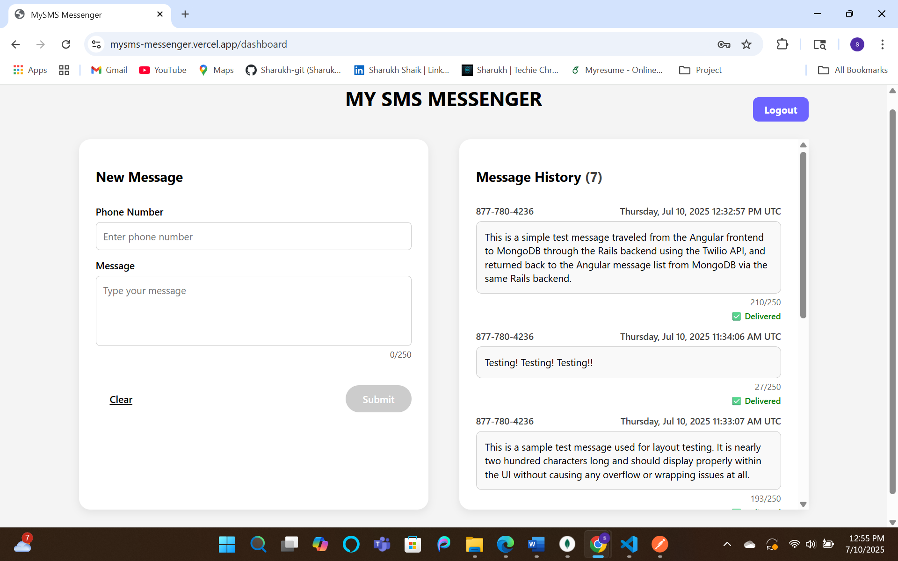
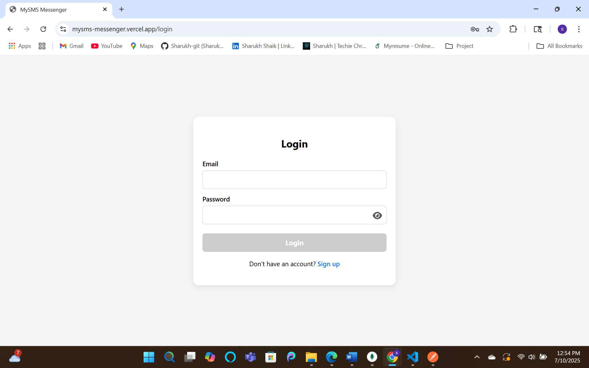

# MySMS Messenger 📩

MySMS Messenger is a full-stack web application that enables users to send and view SMS messages using the Twilio API.

---

## 🌐 Live Demo

🔗 [View Live App](https://mysms-messenger.vercel.app) 

> ⚠️ **Note**: Due to Twilio free account limitations, messages can only be sent to this verified number: **+1 (877) 780-4236** (Twilio virtual number)

- 🔧 Backend: [https://mysms-messenger.onrender.com](https://mysms-messenger.onrender.com)  
- 💻 GitHub: [Sharukh-git/mysms-messenger](https://github.com/Sharukh-git/mysms-messenger)

---

## 🛠️ Tech Stack

- **Frontend**: Angular 20.1.0  
- **Backend**: Ruby on Rails 7.0.8.7  
- **Database**: MongoDB Atlas (via Mongoid)  
- **SMS Provider**: Twilio API  
- **Deployment**: Vercel (Frontend), Render (Backend)  
- **Ruby Version**: 3.2.2  

---

## ✅ Features

### Core Requirements
1. ✅ **Send SMS** messages through a backend API integrated with Twilio  
2. ✅ **Store messages** in MongoDB  
3. ✅ **View previously sent messages** via a messages listing endpoint  
4. ✅ **Restrict visibility** to messages tied to the authenticated user  

### Bonus Features
- ✅ **Bonus 1**: User authentication using Devise (email + password login & logout)
- ✅ **Bonus 2**: Full deployment on Vercel and Render with working CORS + cookie-based session management
- ✅ **Bonus 3**: Twilio webhook integration — shows **delivery status** (✅ Delivered / ❌ Failed / ⏳ Pending)

---

## 🔒 Authentication

- Email/password-based login/signup  
- Sessions managed with secure, HTTP-only cookies  
- Devise used for authentication, with JSON API setup

---

## 🔁 Webhooks

Twilio's status callback URL is used to update the delivery status of each SMS.  
Status values are reflected in the message list UI in real-time.

---

### 📸 UI Screenshots

| **Dashboard View** | **Login Page** |
|--------------------|----------------|
|  |  |

---

### 🧪 Test Account (for demo)

You can either create a new account, or use the test credentials below:

Email: testaccount@example.com
Password: Testlogin$54321

---

## 📦 Setup Instructions

### Backend (`/backend`)
1. Install Ruby & MongoDB
2. Create `.env` with the following keys:
    ```env
    TWILIO_ACCOUNT_SID=
    TWILIO_AUTH_TOKEN=
    TWILIO_PHONE_NUMBER=
    APP_BASE_URL=https://mysms-messenger.onrender.com
    ```
3. Run:
    ```bash
    bundle install
    rails db:setup
    rails server
    ```

### Frontend (`/frontend`)
1. Run:
    ```bash
    npm install
    ng serve
    ```

---

## 👨‍💻 Author

Developed by **Sharukh Shaik**  
GitHub: [@Sharukh-git](https://github.com/Sharukh-git)
